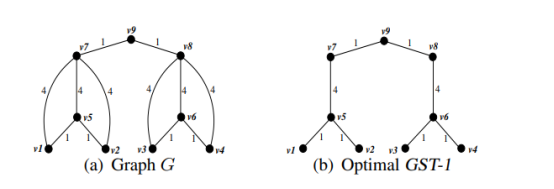

# GST-DPBF

2025 RUC 数据结构与算法2大作业：参考论文和已有框架代码实现解决Group Steiner Tree问题的DPBF算法

## GST问题简介

> 分组斯坦纳树问题是经典斯坦纳树问题（Steiner Tree Problem）的一个扩展。经典斯坦纳树问题是要在图中找到连接给定一组终端顶点（terminal vertices）的权重最小的树。而分组斯坦纳树问题将终端顶点扩展为分组，每个分组内有多个顶点，只需要子树连接到每个分组中的至少一个顶点即可，这使得问题的复杂度和求解难度进一步增加。GST问题的基本定义如下：

- **图的定义**：给定一个无向连通图 $G=(V, E)$，其中 $V$ 是顶点集合，$E$ 是边集合，每条边 $e\in E$ 都有一个非负的权重 $w(e)$。
- **分组的定义**：设有 $k$ 个顶点子集 $S_1, S_2, \cdots, S_k\subseteq V$，这些子集被称为分组（groups）。
- **问题目标**：找到图 $G$ 的一个子树 $T=(V_T, E_T)$，使得对于每个分组 $S_i$（$i = 1,2,\cdots,k$），子树 $T$ 至少包含 $S_i$ 中的一个顶点，并且子树 $T$ 的所有边的权重之和 $\sum_{e\in E_T}w(e)$ 最小。这个子树 $T$ 就被称为分组斯坦纳树。

## DPBF算法简介

> 中文含义为：动态规划 - 分支限界融合算法（Dynamic Programming - Branch and Bound Fusion Algorithm）

 - **基本原理**
   - **动态规划（Dynamic Programming，DP）**：是一种通过把原问题分解为相对简单的子问题，并保存子问题的解来避免重复计算，从而解决复杂问题的方法。它通常适用于具有最优子结构和重叠子问题性质的问题。
   - **分支限界法（Branch and Bound，BB）**：是一种在问题的解空间树中搜索问题解的算法。它通过对解空间树进行广度优先或深度优先搜索，利用限界函数来剪去不可能包含最优解的子树，从而提高搜索效率。
   - **融合思路**：DPBF 算法将动态规划和分支限界法的思想结合起来。在搜索解空间的过程中，利用动态规划保存子问题的解，同时使用分支限界法的限界函数进行剪枝操作，以更高效地找到问题的最优解。
 - **应用场景**
   在组合优化问题，如旅行商问题（TSP）、背包问题等中可能会用到这种融合算法，以平衡搜索的广度和深度，减少不必要的计算。

## 大作业学习目标

- 锻炼文献阅读能力，能够对照伪代码实现具体的C++代码
- 锻炼算法分析设计能力，能够理解并实现较为复杂的动态规划算法解决实际问题
- 锻炼独立思考，解决问题的能力

# 《数据结构与算法2》大作业环境配置和示例运行

## 运行环境

- Windows 11
- Visual Studio 17 2022
- Boost 1.87
- MinGW GCC 8.1.0
- CMake 3.29

## 配置过程

1. 建议先安装Visual Studio 17 2022（直接下载默认安装即可）：https://learn.microsoft.com/en-us/visualstudio/install/install-visual-studio?view=vs-2022，安装选项选择C++有关的套件。不推荐直接使用VScode（未测试），因为编译时需要依赖Visual Studio附带安装的Msbuild工具

2. 然后安装Boost 1.87（该项目依赖Boost库）：

   * 下载:https://sourceforge.net/projects/boost/files/boost-binaries/1.87.0/
     中的`boost_1_87_0-msvc-14.3-64.exe`，运行安装程序，安装地址默认即可（**如果修改了安装地址，则需要修改GST-DPBF/CMakeList.txt的内容，否则将无法找到boost库的位置！）**

   * 如遇到安装问题可以参考链接：windows下简易安装boost:https://blog.csdn.net/ckr__/article/details/109683636

3. 由于Visual Studio 17 2022选择C++套件后一般自带cmake，所以可以直接尝试以下测试流程，测试是否配置完成：

   1. 克隆该项目到本地：`git clone git@github.com:SakuraMarble/GST-DPBF.git` 或者 `https://github.com/SakuraMarble/GST-DPBF.git`

      如遇到无法克隆问题，可以尝试下载压缩包，或联系助教帮忙解决

   2. **使用Visual Studio打开该项目（不要使用VScode）**，按下`ctrl+~`打开终端，确保当前目录为`GST-DPBF`

   3. 在终端输入以下命令：

      ```cmd
      mkdir build
      cd build
      cmake .. -G "Visual Studio 17 2022"
      cmake --build .
      ```

      如遇cmake未安装问题，可参考以下链接：

      * 安装cmake教程:https://blog.csdn.net/weixin_52677672/article/details/135815928

      * 下载链接:https://cmake.org/files/

   4. 执行完成后，当前所在的`build`目录下会有`bin`文件夹产生，执行以下命令进行测试：

      `./bin/Debug/DPBF.exe`

      如发现输出结果为以下内容，则代表环境配置成功：

      ```cmd
      start.. 
      ------------------------------------------------------------
      iteration 0
      0
      ------------------------------------------------------------
      iteration 1
      0
      ------------------------------------------------------------
      iteration 2
      0
      ------------------------------------------------------------
      iteration 3
      0
      ------------------------------------------------------------
      iteration 4
      0
      ------------------------------------------------------------
      iteration 5
      0
      ------------------------------------------------------------
      iteration 6
      0
      ------------------------------------------------------------
      iteration 7
      0
      ------------------------------------------------------------
      iteration 8
      0
      ------------------------------------------------------------
      iteration 9
      0
      ------------------------------------------------------------
      ```

## 代码结构

- `data/` 

  - `data0~9.csv`以csv格式保存的图数据，点的权重全为0，只需要关注边权即可。注意，其中不仅包含图的**原始数据**，也包括**分组情况**、待查询的目标，具体结构将在下文详细阐述。

  - `result`：查询得到的正确cost结果，即你最后实现的代码输出应当为：

    ```cmd
    start.. 
    ------------------------------------------------------------
    iteration 0
    3
    ------------------------------------------------------------
    iteration 1
    4
    ------------------------------------------------------------
    iteration 2
    6
    ------------------------------------------------------------
    iteration 3
    3
    ------------------------------------------------------------
    iteration 4
    5
    ------------------------------------------------------------
    iteration 5
    10
    ------------------------------------------------------------
    iteration 6
    6
    ------------------------------------------------------------
    iteration 7
    6
    ------------------------------------------------------------
    iteration 8
    19
    ------------------------------------------------------------
    iteration 9
    18
    ------------------------------------------------------------
    ```

- `rucgraph/graph_v_of_v_idealID_DPBF_only_ec.h`: 算法代码（**你需要提供的实现**）

- `rucgraph/test_cpu.h`: 读入图、查询；检验结果

- `rucgraph`目录下还提供了一些有用的辅助函数，函数名十分清晰地表示了其作用。

## 数据说明

共有十个数据，分别为data0.csv，data1.csv，...，data9.csv
以data0.csv为例：

* input_graph：描述原始图数据

  - input_graph |V|=8 |E|=24 表示图有8个节点，24条边。

  - input_graph Vertex 7 表示有一个编号为7的节点

  - input_graph Edge 6 7 3 表示节点6，7之间有一条边权为3的边

* group_graph：描述分组信息，分组以**标签值**作为区分

  - group_graph |V|=11 |E|=3 表示包含标签集的图的节点数为11（8+3），标签与3个节点相连。

  - group_graph Edge 1 9 1 表示节点1与标签9相关联。

* 待查询目标：最后的GST需要包含哪些标签值的点

  - |T|=3表示查询的大小为3

  - group_vertices 10 ...  group_vertices 8 表示查询的标签是8，9，10，即最后的GST需要包括8，9，10标签的分组的各至少一个点

## 函数参数说明

"graph_v_of_v_idealID_DPBF_only_ec" 函数接受三个参数

- v_instance_graph：不包含标签集的原始图
  - 图以二维vector形式（**邻接链表**）保存，元素为pair<int,int>。其中第一个int表示邻接点，第二个int表示边权。
  - 对于有V个节点的图，vector的第一维度大小为V。即v_instance_graph[i] 表示节点i的邻接表，v_instance_graph[i]中的每个元素表示节点i关联的一条边，
  - 例如：v_instance_graph[i][j].first()表示节点i第j条边关联的节点，v_instance_graph[i][j].second()表示这条边的边权。
- v_generated_group_graph：包含标签集的图
  - 图的保存形式与v_instance_graph相同。
  - 对于有V个节点的图，假设查询的大小为K，则该图的节点数量为V+K。其中，最后K个节点表示查询的K个标签集。
  - 每个标签集与前V个节点中的若干点有边相连，这些边表示了标签集包含哪些节点。
  - 可以认为最后K个节点是“虚拟点”，仅用于表示原始图数据中的分组情况
- group_vertices：待查询的标签
  - 一个unordered_set， 元素为v_generated_group_graph中的后K个节点。

## 问题举例

以下图(a)为例，假设我们已知：p1包含v1，p2包含v2，p3包含v3，p4包含v4（p为标签集合，v为节点）

一次查询的标签集为p1，p2，p3，p4，则下图(b)表示该查询得到的最优GST树，因为该树包括了p1，p2，p3，p4每个标签集中的至少一个点，并且总边权最小。




以下是结合此例对相关参数的解释，便于对各个参数的理解：

- v_instance_graph[0].size() = 2 表示点v1的度为2;
- v_instance_graph[0][0].first() = 4表示v1-v5有一条边;
- v_instance_graph[0][0].second() = 1 表示v1-v5的边的边权为1;
- v_instance_graph[0][1].first() = 6表示v1-v7有一条边;
- v_instance_graph[0][1].second() = 14表示v1-v7的边的边权为4;
- group_vertices包含四个点，9，10，11，12，分别对应四个标签集p1，p2，p3，p4。
- v_generated_group_graph[9].size() = 1，表示标签集p1包含的节点数量为1;
- v_generated_group_graph[9][0].first() = 0，表示标签集p1包含节点v1。

## 参考文献

Finding Top-k Min-Cost Connected Trees in Databases：https://www.microsoft.com/en-us/research/wp-content/uploads/2016/02/icde07steiner.pdf
